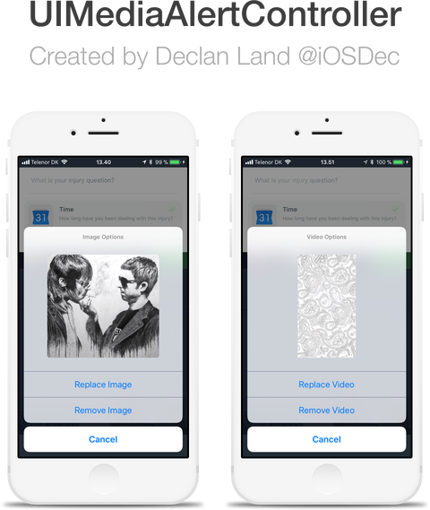

# UIMediaAlertController

UIAlertController extension for selecting images / videos.<br>
Written in *Objective-C*.

*Created By: [Declan Land](https://twitter.com/declanland)*

**Features**<br>
*	Completion handlers<br>
*	Ease of use<br>
*	Media Preview<br>
*	Customisable<br>



---

### Installation

Download the contents of this repo and add these files to your project:<br>
```
UIMediaAlertController.h
UIMediaAlertController.m
UIMedia.h
UIMedia.m
```
Include these frameworks in your project:
```objc
#import <AVFoundation/AVFoundation.h>
#import <MobileCoreServices/MobileCoreServices.h>
#import <ImageIO/ImageIO.h>
```
---

### Usage

First, import the *UIMediaAlertController.h* file into the place you want to
use it:
```objc
#import "UIMediaAlertController.h"
```

There are 2 methods of using the UIMediaAlertController:
   -   Shared Instance
   -   Stored Property

The benefits of using the shared instance is that it's really simple to call,
and that the same UIMedia object is used throughout the app - unless you call:
[UIMediaAlertController resetMedia];
For example:

```objc
[UIMediaAlertController presentWithType:MediaTypeImage picked:^{
   // Retreive global media by using:
   UIMedia *media = [UIMediaAlertController media];
   // Reset global media:
   [UIMediaAlertController resetMedia];
}];
```

The other method, is storing the UIMediaAlertController property in your
header file *MyViewController.h* like so:

```objc
//	MyViewController.h

#import "UIMediaAlertController.h"

@implementation MyViewController : UIViewController

@property (strong, nonatomic) UIMediaAlertController *uimac;

@end

```

*MyViewController.m*":

```objc

@implementation MyViewController

- (IBAction)chooseImageButtonClicked:(UIButton *)sender {
   self.uimac = [[UIMediaAlertController alloc] init];
   [self.uimac presentWithType:MediaTypeImage picked:^{
	// get media:
	UIMedia *media = self.uimac.media;
	// resent media:
	[self.uimac resetMedia];
   }];
}

@end

```
