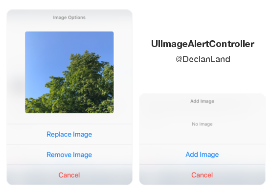

## UIImageAlertController

UIViewController extension class (Objective-C) for picking / displaying images from the Photo Library (UIImagePickerController).

------------

#### Installation

Click the green "Clone or download" button near the top right of this page, this will download this repositary as a zip file.

Drag both the ***UIImageAlertController.h*** and the ***UIImageAlertController.m*** files into your Xcode Project.

Import the ***UIImageAlertController.h*** header file into your project like so:

	#import "UIImageAlertController.h"

------------

#### Usage

UIImageAlertController must be used inside a UIViewController class. For an example, let's use it inside the ***viewDidLoad*** method.

***[self presentImageAlertController]*** will present the image alert controller.

There is also a notification handler you can use to handle your picked image and also for when the image has been reset which are demonstrated below.

Of course, you can also add your own custom NSNotificationCenter handlers without having to comply with the UIViewController extension class. Definitions for the notification keys are located in the header file.

	- (void)viewDidLoad {
	
		//	Present Image Alert Controller
		[self presentImageAlertController];
		
		//	Add Picked Handler:
		[self addUIImageAlertControllerDelegate:@selector(customImagePicked:)];
		
		//	Add Reset Handler:
		[self addUIImageAlertControllerDelegate:@selector(customImageReset:)];
	
	}
	
	- (void)customImagePicked:(NSNotification *)notification {
	
		UIImage *image = (UIImage *)notification.object;
		//	do something with image.
		
	}
	
	- (void)customImageReset:(NSNotification *)notification {
		
		//	image has been reset. clear image
		
	}

------------

#### Custom image size

To customise the image width / height, there are definitions at the top of the ***UIImageAlertController.m*** file:

	#define kUIIACImageWidth                250
	#define kUIIACImageHeight               230

------------

##Credits

Created by Declan Land @iosdec - 2017 | Twitter: https://twitter.com/declanland
